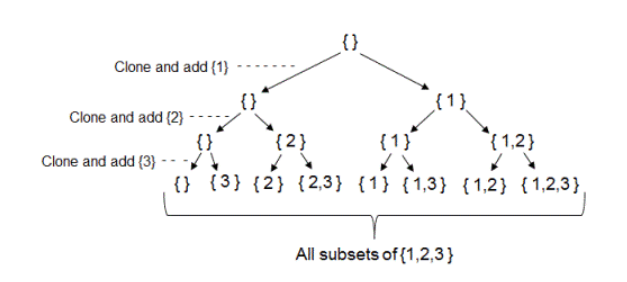

## find every Sub sequence of sequence from n numbers

The function `subSets(set[], sub_set[], n, k)` is designed to generate all subsequences. The input `set` represents a given set of elements, and `sub_set` is a subset consisting of the first k elements of the set.

## Definitions

In this context, a "subsequence" refers to any sequence that can be derived from the original sequence by deleting zero or more elements without changing the order of the remaining elements.

## Algorithm

The algorithm works recursively to generate all possible subsequences of the first k elements of the input set.

Execution
The function is initially called with k=0 to start generating subsequences.
The base case is reached when k equals n, and the generated subsequence is printed.
In each step, the algorithm either includes or excludes the current element from the subset and recursively generates subsequences.

# Examples of Generating Subsequences

Consider the set `set = [1, 2, 3]` and use the function `subSets(set, sub_set, 3, 0)` to generate and print all possible subsequences of the first 3 elements:

